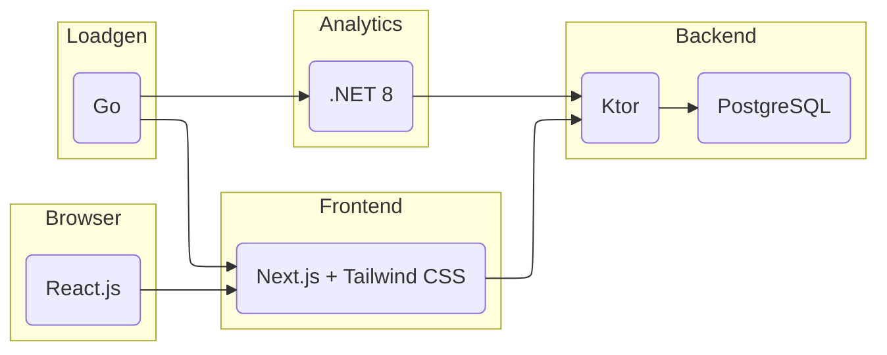

# Really Nais Examples

This repository contains a collection of example applications for the Nais platform. The main example is a Quotes application, where users can view and create quotes. Each service demonstrates a specific technology stack and integration pattern commonly used in modern cloud-native applications on Nais.

Another key purpose of these examples is to showcase the observability features available in the Nais Platform, based on OpenTelemetry. This includes:

- **Logs** collected in Loki
- **Metrics** collected in Prometheus
- **Traces** collected in Tempo

All observability data is available and visualized in Grafana, making it easy to monitor, debug, and understand your applications running on Nais.

## Purpose

The purpose of this repository is to help developers understand how to:

- Build and deploy frontend, backend, and load generation services on Nais
- Integrate with managed databases (PostgreSQL)
- Use modern frameworks and best practices for cloud applications

## High-Level Overview

This repository consists of the following services:

| Service                              | Tech Stack                   | Purpose & Description                                                                |
| ------------------------------------ | ---------------------------- | ------------------------------------------------------------------------------------ |
| [quotes-frontend](quotes-frontend)   | Next.js, React, Tailwind CSS | The web frontend for the Quotes app, allowing users to view and submit quotes.       |
| [quotes-backend](quotes-backend)     | Kotlin, Ktor, PostgreSQL     | The backend API for the Quotes app, handling quote storage and retrieval.            |
| [quotes-analytics](quotes-analytics) | .NET 8, ASP.NET Core         | Analytics service with OpenTelemetry auto-instrumentation and custom traces/metrics. |
| [quotes-loadgen](quotes-loadgen)     | Go (Golang)                  | A load generator for simulating traffic and testing the Quotes application.          |

For more details on each service, see the README in the respective subdirectory:

- [quotes-frontend/README.md](quotes-frontend/README.md)
- [quotes-backend/README.md](quotes-backend/README.md)
- [quotes-analytics/README.md](quotes-analytics/README.md)
- [quotes-loadgen/README.md](quotes-loadgen/README.md)

## Architecture

A high-level overview of the Quotes application and its dependencies:

## License

The code in this repository is licensed under the MIT license. See [LICENSE](LICENSE) for more information.
