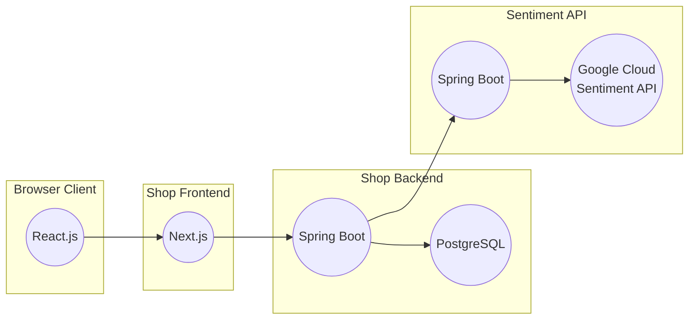

# Really NAIS examples

A collection of example apps demonstrating features and concepts in and around NAIS.

| Example                        | Language | Description                                                          |
| ------------------------------ | -------- | -------------------------------------------------------------------- |
| [shop-frontend](swag-shop)     | Next.js  | A simple webshop using [NAV's design system][aksel] and Tailwind CSS |
| [shop-backend](shop-backend)   | Kotlin   | A simple Spring Boot API with a PostgreSQL database                  |
| [sentiment-api](sentiment-api) | Kotlin   | A simple Spring Boot API with Google Cloud Sentiment Analysis        |

A high-level overview of the example apps and their dependencies:

[aksel]: https://aksel.nav.no/

## License

The code in this repository is licensed under the MIT license. See [LICENSE](LICENSE) for more information.
