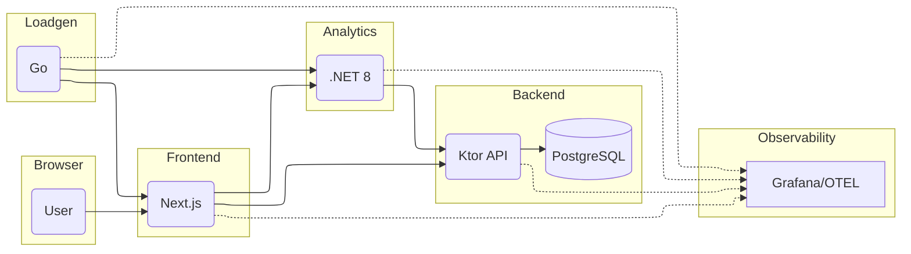

# Really Nais Examples

This repository contains a collection of example applications for the Nais platform. The main example is a Quotes application, where users can view and create quotes. Each service demonstrates a specific technology stack and integration pattern commonly used in modern cloud-native applications on Nais.

Another key purpose of these examples is to showcase the observability features available in the Nais Platform, based on OpenTelemetry. This includes:

- **Logs** collected in Loki
- **Metrics** collected in Prometheus
- **Traces** collected in Tempo

All observability data is available and visualized in Grafana, making it easy to monitor, debug, and understand your applications running on Nais.

## Purpose

The purpose of this repository is to help developers understand how to:

- Build and deploy frontend, backend, and load generation services on Nais
- Integrate with managed databases (PostgreSQL)
- Use modern frameworks and best practices for cloud applications

## High-Level Overview

This repository consists of the following services:

| Service                              | Tech Stack                   | Purpose & Description                                                                                              |
| ------------------------------------ | ---------------------------- | ------------------------------------------------------------------------------------------------------------------ |
| [quotes-frontend](quotes-frontend)   | Next.js, React, Tailwind CSS | The web frontend for the Quotes app, allowing users to view and submit quotes. Includes analytics dashboard.       |
| [quotes-backend](quotes-backend)     | Kotlin, Ktor, PostgreSQL     | The backend API for the Quotes app, handling quote storage and retrieval.                                          |
| [quotes-analytics](quotes-analytics) | .NET 8, ASP.NET Core         | Analytics service that processes quote data from the backend, providing insights and custom OpenTelemetry metrics. |
| [quotes-loadgen](quotes-loadgen)     | Go (Golang)                  | A load generator for simulating traffic and testing the Quotes application.                                        |

## Integration Flow

1. **Users** interact with the **quotes-frontend** (Next.js) to view and submit quotes
2. **Frontend** communicates with **quotes-backend** (Kotlin/Ktor) for quote storage/retrieval
3. **Analytics service** (.NET) processes quotes from the backend to provide:
   - Word count analysis
   - Sentiment scoring
   - Quote categorization
   - Custom OpenTelemetry metrics
4. **Frontend** displays analytics via a dedicated `/analytics` page
5. **Load generator** (Go) simulates traffic to test the entire system
6. All services send **observability data** (traces, metrics, logs) to the OTEL stack

## Quick Start

```bash
# Start all services
docker-compose up -d

# Access the application
open http://localhost:3000          # Frontend (quotes + analytics)
open http://localhost:8080          # Backend API
open http://localhost:8081          # Analytics API
open http://localhost:3000/analytics # Analytics Dashboard
open http://localhost:3000          # Grafana (logs, metrics, traces)
```

For more details on each service, see the README in the respective subdirectory:

- [quotes-frontend/README.md](quotes-frontend/README.md)
- [quotes-backend/README.md](quotes-backend/README.md)
- [quotes-analytics/README.md](quotes-analytics/README.md)
- [quotes-loadgen/README.md](quotes-loadgen/README.md)

## Architecture

A high-level overview of the Quotes application and its dependencies:


```mermaid
---
config:
  flowchart:
    defaultRenderer: elk
---
graph LR

  subgraph Browser
  A(User)
  end

  subgraph Frontend
  B(Next.js)
  end

  subgraph Backend
  C(Ktor API)
  D[(PostgreSQL)]
  end

  subgraph Analytics
  F(.NET 8)
  end

  subgraph Loadgen
  E(Go)
  end

  subgraph Observability
  G[Grafana/OTEL]
  end

  A --> B
  B --> C
  B --> F
  C --> D
  F --> C
  E --> B
  E --> F

  B -.-> G
  C -.-> G
  F -.-> G
  E -.-> G

```

## Feature Flags with Unleash

This project demonstrates [Unleash](https://docs.nais.io/services/feature-flagging/) feature flagging on the NAIS platform. Unleash lets you toggle features on and off without redeploying.

### How it works

Each service has an [Unleash API token](https://docs.nais.io/services/feature-flagging/#step-2-define-an-apitoken-for-your-application) defined in `.nais/unleash.yaml`. When deployed, the NAIS Unleash operator provisions a client token and stores it as a Kubernetes secret. The app reads the secret via `envFrom` in `.nais/app.yaml`:

```yaml
# .nais/app.yaml
envFrom:
  - secret: quotes-backend-unleash-api-token
```

This provides the environment variables `UNLEASH_SERVER_API_URL`, `UNLEASH_SERVER_API_TOKEN`, and `UNLEASH_SERVER_API_ENVIRONMENT` to the application at runtime.

### Feature flags in use

| Flag            | Service                         | Effect                                                                                                                                                        |
| --------------- | ------------------------------- | ------------------------------------------------------------------------------------------------------------------------------------------------------------- |
| `quotes.submit` | quotes-backend, quotes-frontend | Controls whether users can submit new quotes. When disabled, the backend returns 403 and the frontend hides/disables the submit button.                       |
| `quotes.errors` | quotes-backend                  | Enables simulated error injection (10% error rate on GET/POST endpoints). Default: **disabled**. Turn on to generate errors visible in dashboards and alerts. |

### Adding a new feature flag

1. **Create the toggle** in the [Unleash UI](http://localhost:4242) (or on NAIS at your team's Unleash instance)
2. **Check the flag in code:**

   **Kotlin (backend):**

   ```kotlin
   if (FeatureFlags.isEnabled("my.new.flag")) {
       // feature code
   }
   ```

   **TypeScript (frontend, server-side):**

   ```typescript
   import { isEnabled } from '@/utils/unleash';
   const enabled = isEnabled('my.new.flag');
   ```

3. **Register the flag name** in `FeatureFlags.kt` (backend) or `unleash.ts` (frontend) so it appears in the `/api/features` endpoint

### Local development

Unleash runs locally via docker-compose on port 4242. The admin UI is at <http://localhost:4242> (no login required with the dev setup).

To create the `quotes.submit` toggle locally:

1. Start infrastructure: `mise run infra:up`
2. Open <http://localhost:4242>
3. Create feature flags named `quotes.submit` and `quotes.errors` in the `development` environment
4. Enable or disable them to see the effect in the running application

The local client token `default:development.client-token` is pre-configured in both `.mise.toml` (for `mise run dev`) and `docker-compose.yaml`.

### Graceful degradation

When Unleash is unavailable (no env vars set, or server unreachable), all feature flags default to **enabled**. This means:

- Tests run without Unleash — all features work normally
- A misconfigured Unleash connection won't break the application

## License

The code in this repository is licensed under the MIT license. See [LICENSE](LICENSE) for more information.
