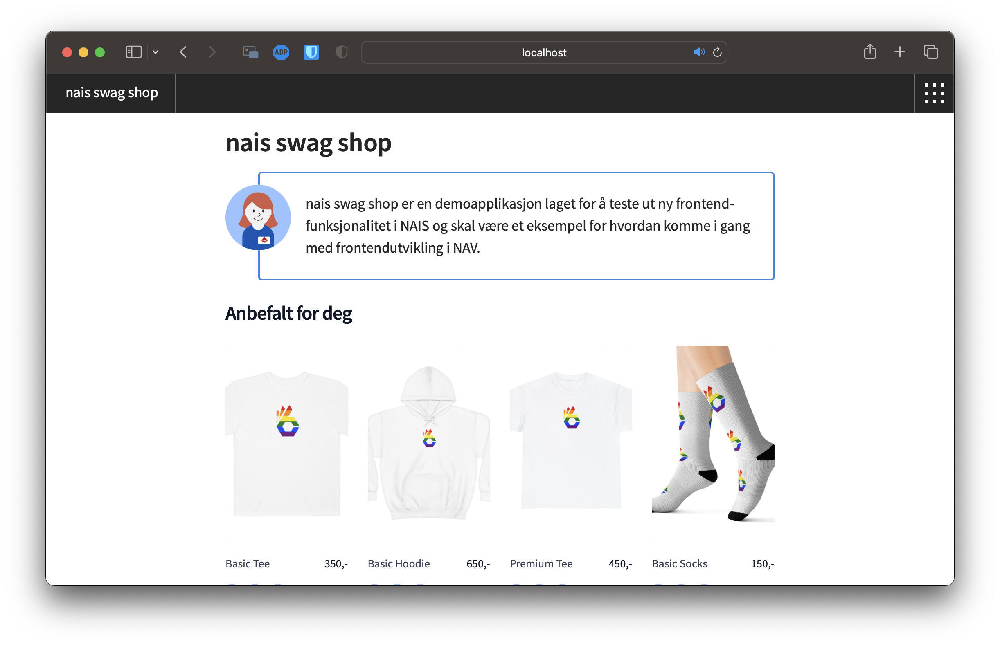
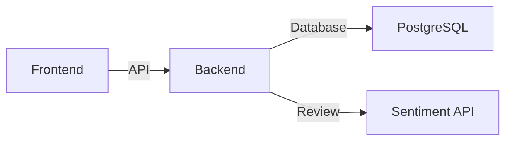

# NAIS Swag Shop

NAIS Web Shoper en eksempel nettbutikk for å bestille NAIS Swag til bruk på konferanser, arrangementer og lignende.

## Teknologi

* [Next.js](https://nextjs.org/)
* [TypeScript](https://www.typescriptlang.org/)
* [Designsystemet](https://aksel.nav.no/)
* [Tailwind CSS](https://tailwindcss.com/)

## Arkitektur

## Utvikling

### Komme i gang

0. Klon repoet
1. Installer avhengigheter: `npm install`
2. Start utviklingsserver: `npm run dev`
3. Åpne [http://localhost:3000](http://localhost:3000)

## Lisens

NAIS Web Shoper lisensiert under [MIT-lisensen](../LICENSE).