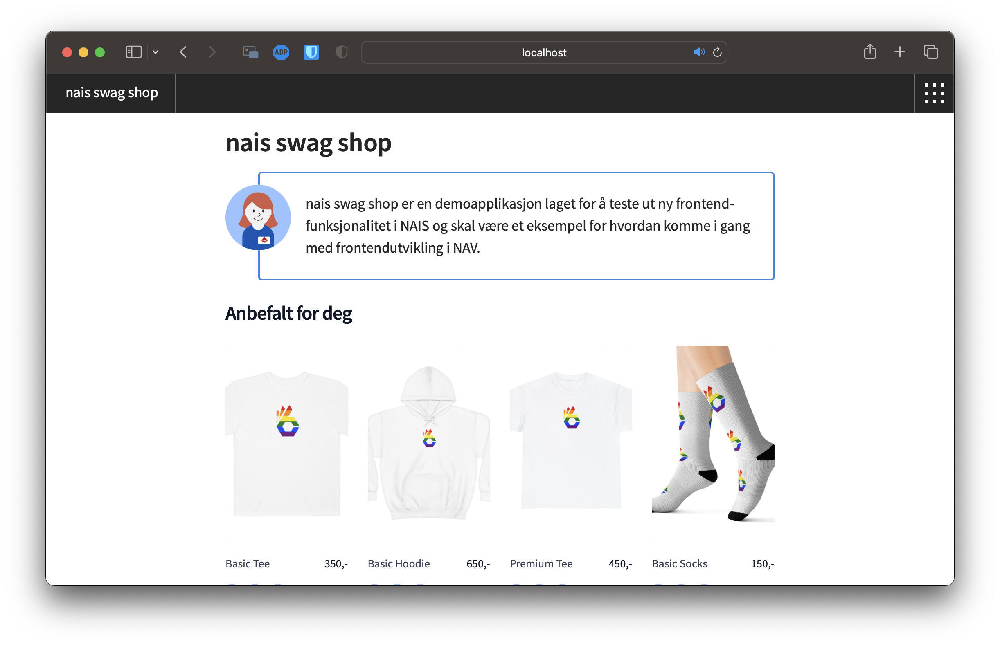
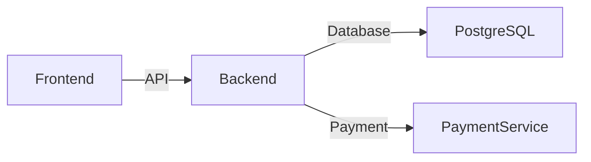

# NAIS Swag Shop

NAIS Swag Shop er en eksempel nettbutikk for å bestille NAIS Swag til bruk på konferanser, arrangementer og lignende.

## Teknologi

* [Next.js](https://nextjs.org/)
* [TypeScript](https://www.typescriptlang.org/)
* [Designsystemet](https://aksel.nav.no/)
* [Tailwind CSS](https://tailwindcss.com/)

## Arkitektur

## Observerbarhet

NAIS Swag Shop benytter [OpenTelemetry](https://opentelemetry.io/) standarden for å samle inn metrikker og sporing av forespørsler.

### Next.js Backend

Next.js har støtte for OpenTelemetry gjennom `experimental.instrumentationHook = true`. Dette gjør at Next.js vil kalle en funksjon som heter `instrument` for hver forespørsel. Denne funksjonen kan brukes til å instrumentere applikasjonen med OpenTelemetry. Mer informasjon om dette finnes i [dokumentasjonen til Next.js](https://nextjs.org/docs/pages/building-your-application/optimizing/open-telemetry).

### Next.js Frontend

For å instrumentere frontend bruker vi [Grafana Faro](https://grafana.com/oss/faro/). Mer om det senere...

## Utvikling

### Komme i gang

0. Klon repoet
1. Installer avhengigheter: `npm install`
2. Start utviklingsserver: `npm run dev`
3. Åpne [http://localhost:3000](http://localhost:3000)

## Lisens

NAIS Swag Shop er lisensiert under [MIT-lisensen](../LICENSE).